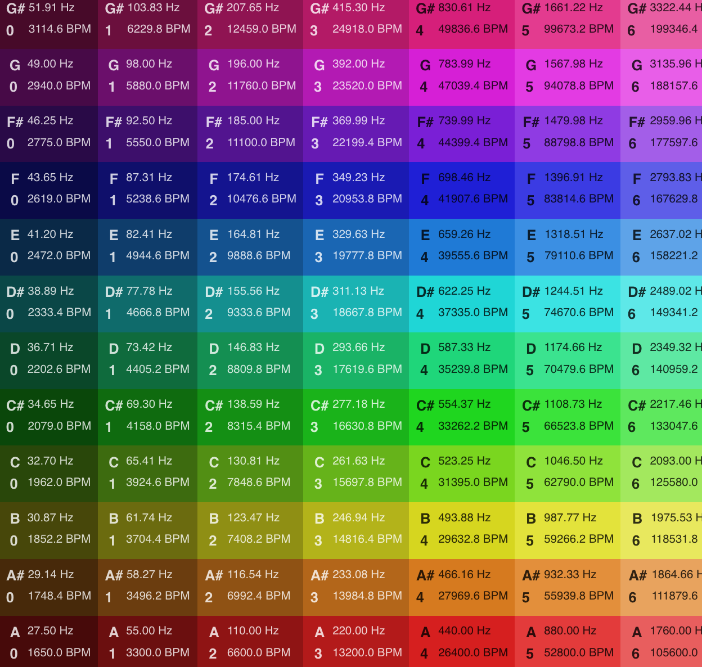

# A vast table of all musical notes and corresponding rhythm tempos

When you slow down a square or sawtooth wave oscillator, you get acoustic beat, that still conforms the octave rule. Exploring different beats playing together helps better understand the harmony of simple pitch ratios and feel the vibe of experimental polyrhythms. It's a place to explore the transition of our perception from the tempo to the pitch.

## Chromatone apps

Visual music language interactive education, research and practice tools.

Chromatone is based on a scientific view on human perception of colors, sounds and relationships between them.
Red is first visible frequency of light spectrum, that we can join in a wheel and equally divide into 12 main colors. A is first among those 12 notes that equally divide cyclical acoustic octaves. So we come up with a connection of two sense systems, that happens in our brain. And it appears to be a great tool to better feel and understand music, visual design and beyond.

We develop a toolset for anyone who wants to see music and hear colors by themselves. Essentially it's an artifical synesthesia development toolkit. And you can use it to learn and teach, explore and compose, memorize and visualize music and even convert pictures to melodies.

[chromatone.center](https://chromatone.center)

The project is non-commercial and is in early development state now. It requires a lot of coding, testing and debugging, and also some architectural thought. Chromatone apps are an effort to construct a really flexible, yet simple cross-platform audio-visual interactive component system, that can be used to build a big range of complex education and exploration tools by music and design enthusiasts.

If you are willing to help, check our current [Projects](https://github.com/DeFUCC/chromatone/projects) status, pick some of our [Issues](https://github.com/DeFUCC/chromatone/issues), or just email your thoughts to [davay@frkt.ru](mailto:davay@frkt.ru).
